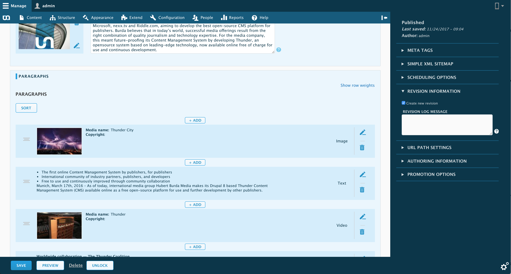

#  Thunder 

Thunder is a Drupal 8 distribution for professional publishers. It consists of the current Drupal 8 functionality, lots of useful modules from publishers and industry partners, and an environment which makes it easy to install, deploy and add new functionality.

## Installing Thunder
Instructions on how to install Thunder can be found at the [installation guide](https://thunder.github.io/thunder-documentation/quick-install).

### Updating Thunder 2 to Thunder 3
If you want to update from Thunder 2 to Thunder 3 some manual steps are necessary, they are described here:

[How to update Thunder 2 to Thunder 3](https://thunder.github.io/thunder-documentation/update-2-to-3)

## Feature Highlights
###  Storytelling
Create thrilling articles with multimedia content. It’s easy to enrich your article with pictures, video, and social media snippets and arrange everything as you like it.

###  Media handling
Add pictures, galleries and videos to your article by just dragging and dropping everything right where you need it.
###  Mobile friendly
With Thunder, editors and administrators can work from any device – on the go, easy and fast. Users benefit from a modern and flexible front end.

###  Schedule content
Plan at which day and time articles should be published – and when they shouldn’t be visible to the public anymore.
###  Flexible system
Benefit from a wide range of additional functionality by industry partners or by one of more than 2,500 modules from the Drupal community.
###  Open Source
Using open source technology reduces development costs and resources and makes you part of the Drupal community with more than 100,000 users actively contributing.

*[More information about the modules used in Thunder](https://burdamagazinorg.github.io/thunder-documentation/modules)*

## Support
For general help using Thunder, please refer to [the official Thunder documentation](https://thunder.github.io/thunder-documentation).

### Community support
For additional help, you can use one of this channel to ask question:

* [Slack](https://thunder.org/contact-us) (highly recommended for faster support)
* [Twitter](https://twitter.com/ThunderCoreTeam)
* [Facebook](https://www.facebook.com/Thunder-CMS-168018513979183/).

## Contributing
If you want to help, to make Thunder even better, please take a look at the [contributing guidelines](CONTRIBUTING.md).

## Development
For information on the installation and development of Thunder, please take a look at [docs/development.md](docs/development.md).
